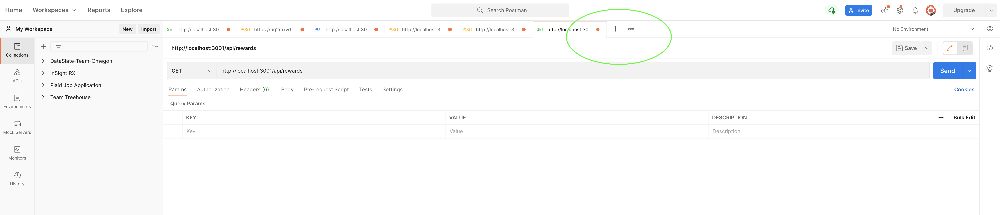
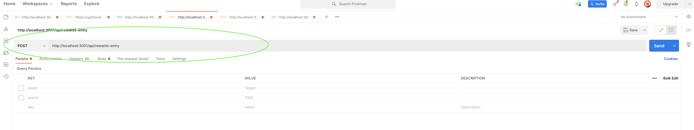
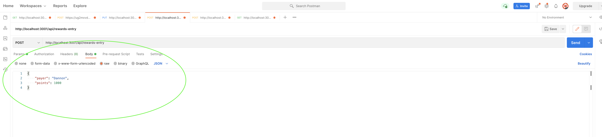
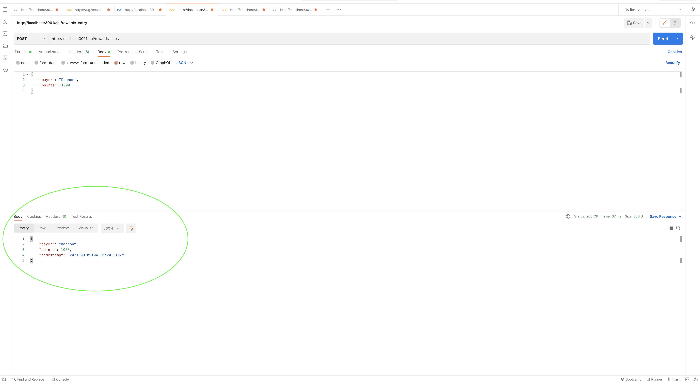
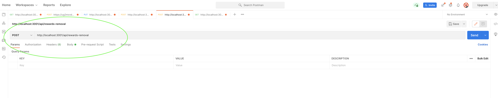
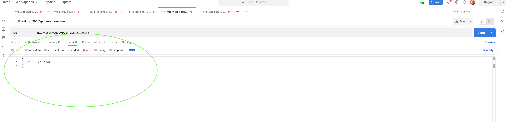
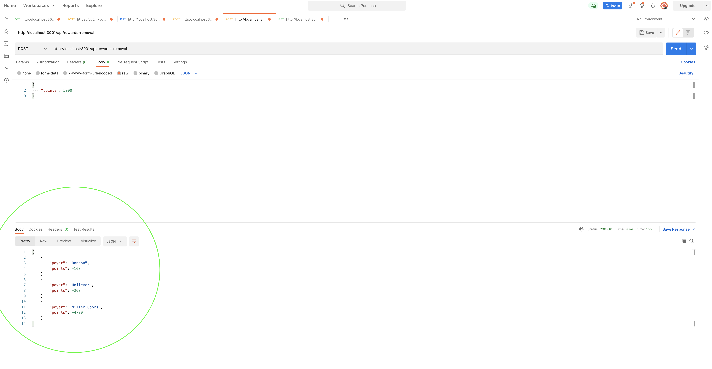
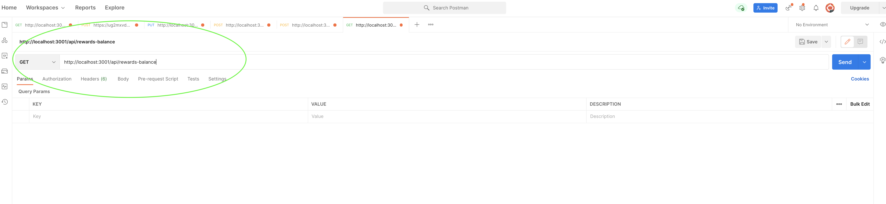
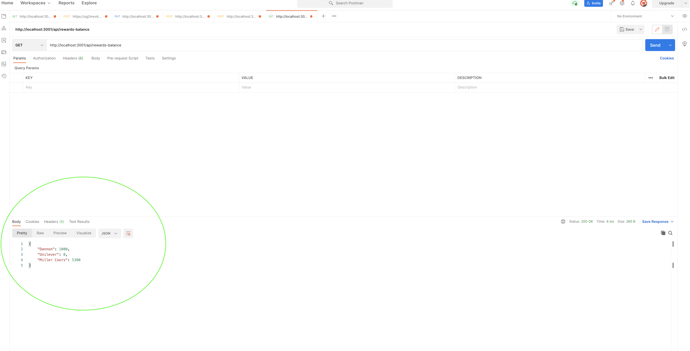

# API Rewards Backend Challenge
Fetch Rewards Backend Exercise


## Description

This projects is a web service (API) with three different end points. These endpoints accept HTTP requests and return responses based on the guidelines that are outlined in this description and the [Acceptance-Criteria](#acceptance-criteria) section.

The endpoints or routes, that this application contains allows a user to:
  * Add transactions for a specific payer and date.
  * Spend points using the rules listed below and return a list of ​{ "payer": <string>, "points": <integer> }​ for each call.
  * Return all payer point balances.

For adding transactions, the route must except/create an object that contains: ​payer​ (string), ​points​ (integer), ​timestamp​ (date).
Once there are transactions inputted the user must be able to take points away from those transactions. When this is done, there are two rules to follow:
  * The oldest points must to be spent first (oldest based on transaction timestamp, not the order they’re received)
  * And no payer's points are to go negative.
## Table of Contents

  * [User-Story](#user-story)
  * [Acceptance-Criteria](#acceptance-criteria)
  * [Visuals](#visuals)
  * [Installation](#installation)
  * [Usage](#usage)
  * [License](#license)
  * [Contributing](#contributing)
  * [Tests](#tests)
  * [Questions](#questions)
## User Story

```
As a rewards business
We want to be able enter transactions of payers, the amount of reward points, and the time that transaction was created.
When a user wants to use their rewards points, the accounting department wants to track what points are being taken away from which payers.
That way we know which payer/partner's points are being used
```

## Acceptance Criteria

```
The web service must be able to run successfully.

It must also have the following routes:
  * Add transactions for a specific payer and date.
  * Spend points using the rules above and return a list of ​{ "payer": <string>, "points": <integer> }​ for each call.
  * Return all payer point balances.

Each of the above routes must return these expected results: 
  * Adding transactions: { "payer": "DANNON", "points": 1000, "timestamp": "2020-11-02T14:00:00Z" }
  * Spending points: 
    - Take in an object structured like this: { "points": 5000 }
    - Return this response:
      [
          { "payer": "DANNON", "points": -100 },
          { "payer": "UNILEVER", "points": -200 },
          { "payer": "MILLER COORS", "points": -4,700 }
      ]
  * Return point balances:
    {
        "DANNON": 1000,
        "UNILEVER": 0,
        "MILLER COORS": 5300
    }
```

## Installation

To access this project:

```
1. Go to https://github.com/alek2535/fetch-backend

2. Fork the branch and then click on clone or download

3. Paste copied link after `git clone` into your bash console in your desired directory

4. You should now have access to the repository
```

Since there is a `package.json`, you will need to run `npm install`.

Once you have the dependancies installed run the command:

`node server.js` or `npm start`

You can also run:

`npm run watch` or `nodemon server.js`

This will allow the server to keep running with any changes that are made to the files in the respository.

 **The next section will contain images and directions on how to use Postman with this Project**

## Visuals and Directions

### Getting Started and the Rewards Entry API
To work with this application, you must have Postman or Insomnia to work in tandem with this application. If you don't have either one, here is the link to download [Postman](https://www.postman.com/downloads/). This is my API platform of choice and I will be showing pictures of how to use it in the context of this application.

Once you have Postman installed and open, plus this application is running by using the above CLI commands, you will click on the plus button circled in this picture: 


This will add an API tab that you can now use for this application. In order to use the points transaction, you must have the HTTP request set to POST with the address http://localhost:3001/api/rewards-entry. You can copy this address and paste it into the input field next to the POST drop-down button. It should look like this:


After you have set this up you can send a JSON object that looks like this:

Make sure that you click on Body, then raw, and set it to JSON. Then you can send an object that looks exactly like the one in the picture.

If everything went well, you should get this response on the bottom:


### The Rewards Removal API

To add another API, click the + symbol again as you did previously. Once the new tab is up, you will want the HTTP response to be set to POST again and the addres to equal http://localhost:3001/api/rewards-removal. It will look like this:


This time you will send an object that looks like this:

Make sure that you click on Body, then raw, and set it to JSON. Then you can send an object that looks exactly like the one in the picture.

Before you run this route, make sure you have entered a few rewards transactions so there is more data for the endpoint to work with. Once you have done this and you have sent an object with the amount of points you would like to see removed from your rewards transactions, you should get a response like this:


### Lastly, the Rewards Points Balance API

Again, you will click the + symbol to add another API tab. After this is new tab is up, you will want to set the HTTP response to GET this time and the address to equal http://localhost:3001/api/rewards-balance. It should look like this:


This time we don't need to send a request body. The route should just return an object that looks like this:


That is the all the current routes that this application has and how to work with them using Postman. If you have any questions you can email me at the address listed below.
## Usage

This application was created as a challenge for the company Fetch Rewards. Although it was designed to their specifications, I'm sure it can be used or further developed to work with other rewards point company or any other application that needs to add and remove points, or something similar.

Technologies Used:

* JavaScript
* Node.js
* Express
## Contributing

Use the [Contributor Covenant Code of Conduct](https://www.contributor-covenant.org/version/2/0/code_of_conduct/code_of_conduct.md)
## License

[MIT License](./LICENSE)

Copyright (c) [2021] [Alek Valencia]

## Project Status

This application has met all the minimum requirements. It can further be developed by:

  * Creating Tests

  * Checking for future bugs or use cases that could break any logic

  * Deleting rewards transactions

  * Editing already entered rewards transactions

## Tests

There are currently no tests for this project.

## Questions

[alek2535](https://github.com/alek2535)

alekvalencia2535@gmail.com

[LinkedIn Profile](https://www.linkedin.com/in/alekvalencia)

If you have any questions about the project you can reach me at the above email or through LinkedIn.